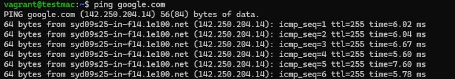
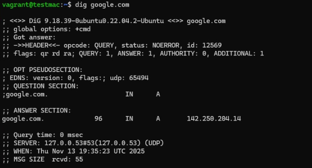
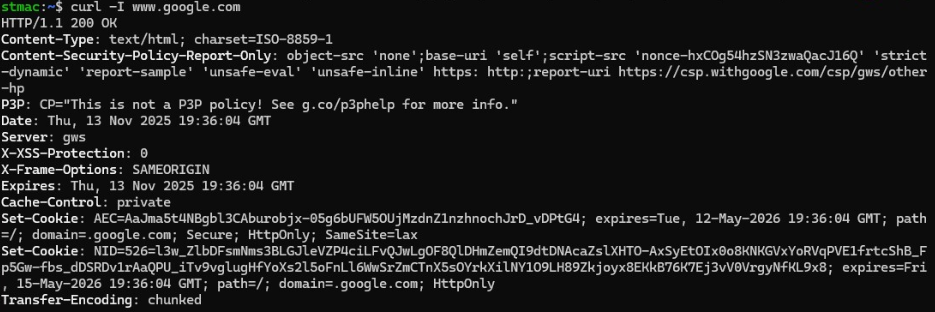
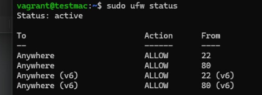
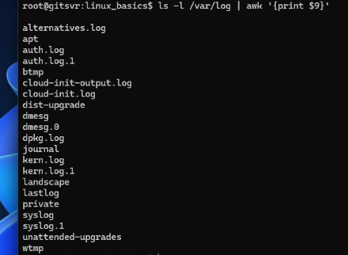

### Some useful commands
To shorten your bash prompt, edit .bashrc
```bash
nano ~/.bashrc
```
Add the following lines at the bottom, save and reload
```
PROMPT_DIRTRIM=2
export PS1="\u@\h:\W$ "
source ~/.bashrc
```


## Linux Network Commands with Outputs

---

### 1️⃣ View IP Address

```bash
ip a
```


### 1️⃣ Check the routing table
```bash
ip route
```


### 1️⃣ Check connectivity
```bash
ping google.com
```


### 1️⃣ Name Resolution
```bash
nslookup google.com
dig google.com
```



### 1️⃣ Download URL headers
```bash
curl -I www.google.com
```


### 1️⃣ Permit port 22 and 80 on host firewall
```bash
sudo ufw status
sudo ufw allow from any port 22
sudo ufw allow from any port 80
sudo ufw enable
sudo ufw status
```





### Print values from a particualr column
```bash
ls -l /var/log | awk '{print $9}' > out.txt
ip -4 addr show | grep inet | awk '{print $2}'
```



### If-else example
```bash
age=18; if [ $age -lt 18 ]; then echo "Less"; elif [ $age -eq 18 ]; then echo "Equal"; else echo "More"; fi
```

### List files on a path using for-loop
```bash
for file in /var/log/*; do echo $file; done
```

### Read file
```bash
while IFS= read -r file; do echo "$file"; done < files.txt
```

### Exec command
```bash
find . -type d -exec chmod 770 {} \;
```

### Character substitution
```bash
echo "10%" | sed 's/%//'
```

### Show the IPV4 address only
ip -4 addr show | grep inet | awk '{print $2}' | cut -d/ -f1

### Working with arrays
```bash
arr=(a b c d e); for i in "${arr[@]}"; do echo "$i"; done
```

### While-loop
```bash
i=0; while [ $i -lt 5 ]; do echo $i; i=$[$i+1]; done
```
