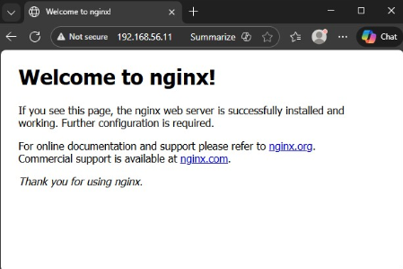
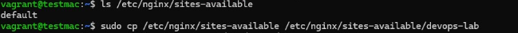
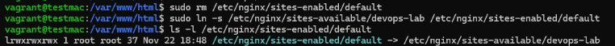
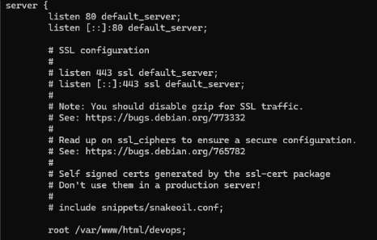
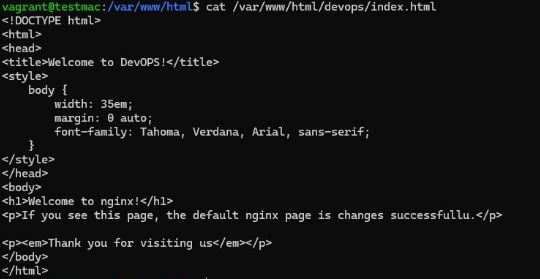

### Mini Web Server Setup
1. Install Nginx
```bash
sudo apt update
sudo apt install nginx -y
sudo systemctl enable --now nginx
```


### By default /etc/nginx/sites-enabled/ is symlink to /etc/nginx/sites-available/default
Remove symlink to default and create newone with your custom URL
```bash
ls -l /etc/nginx/sites-enabled/
sudo rm /etc/nginx/sites-enabled/default
sudo ln -s /etc/nginx/sites-available/devops-lab /etc/nginx/sites-enabled/default
sudo nginx -t
sudo systemctl reload nginx
```




### Create new file on /etc/nginx/sites-available with config default_server and root location, also create index.html file





