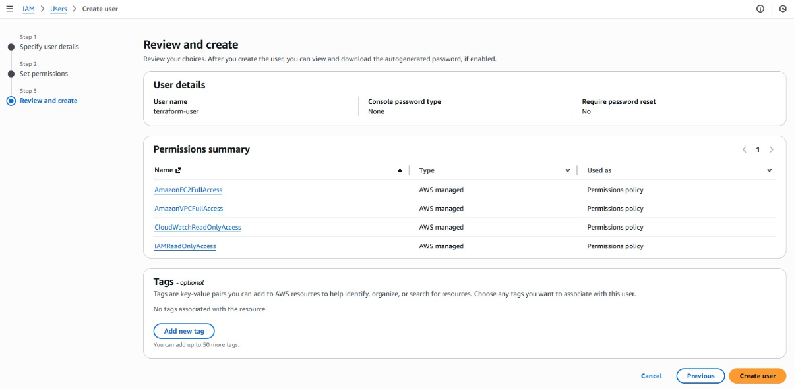
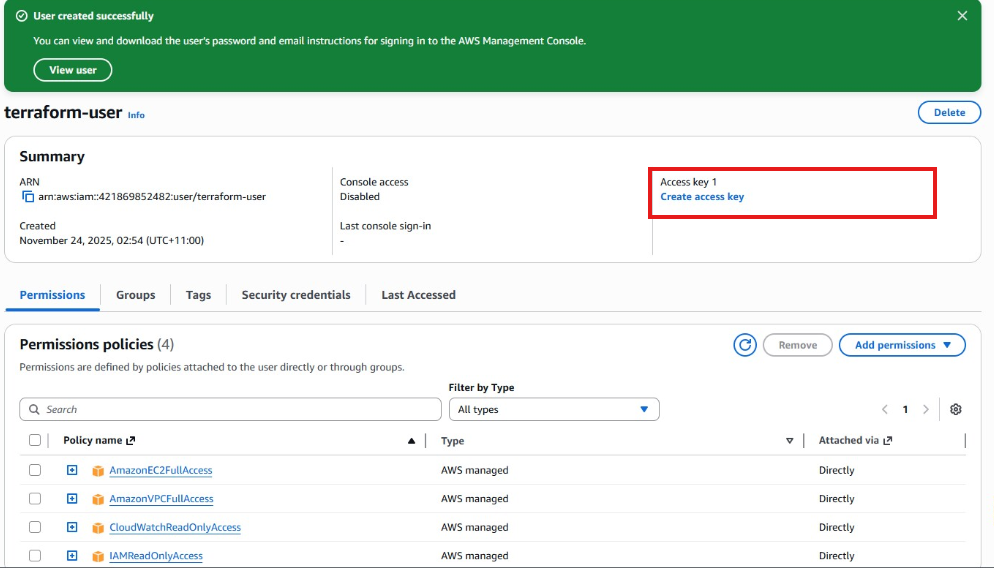
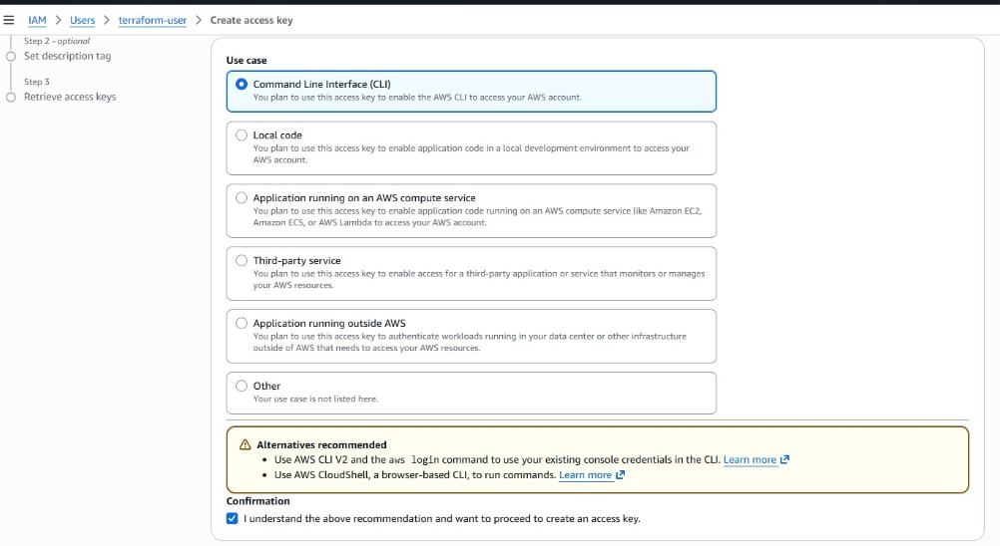
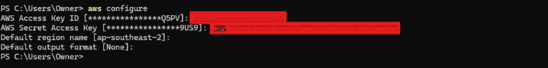
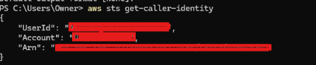

### Create an AWS account 

### Create an IAM user:

Name: terraform-user



Permissions:

* AmazonEC2FullAccess

* AmazonVPCFullAccess

* IAMReadOnlyAccess

* CloudWatchReadOnlyAccess
  


- Enable “Access Key”.



Configure AWS CLI:
```bash
aws configure
```


Test connectivity:
```bash
aws sts get-caller-identity
```


