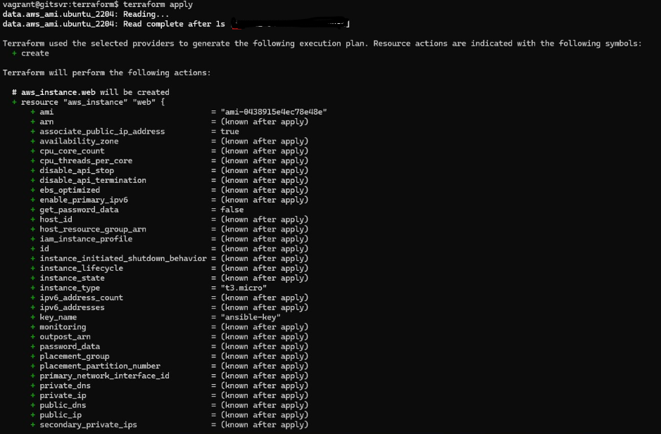
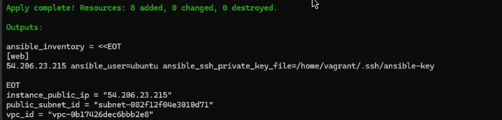
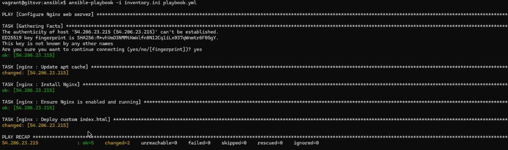

### Exercise 1 — Build Basic Infra (EC2 + VPC)

Create the following using Terraform:

VPC

  ↳ Subnet

  ↳ Internet Gateway

  ↳ Route Table + Route

  ↳ Security Group

EC2 → attach subnet + SG + key

Files to create

```bash
providers.tf # which cloud & version
variables.tf
main.tf
outputs.tf # what to print after
```

Install Terraform

```bash
sudo apt-get update && sudo apt-get install -y gnupg software-properties-common
wget -O- https://apt.releases.hashicorp.com/gpg | sudo gpg --dearmor -o /usr/share/keyrings/hashicorp.gpg
echo "deb [signed-by=/usr/share/keyrings/hashicorp.gpg] \
https://apt.releases.hashicorp.com $(lsb_release -cs) main" | \
sudo tee /etc/apt/sources.list.d/hashicorp.list

sudo apt update
sudo apt install terraform -y
```

Step 1 - Create AWS credentials file manually OR Create SSH key (preferred)

```bash
mkdir -p ~/.aws
nano ~/.aws/credentials

[default]
aws_access_key_id = YOUR_ACCESS_KEY_ID
aws_secret_access_key = YOUR_SECRET_ACCESS_KEY
```
# Create SSH key pair on your local machine

```bash
ssh-keygen -t rsa -b 4096 -f ~/.ssh/ansible-key
```

Step 2 - Create AWS config file

```bash
nano ~/.aws/config

[default]
region = ap-southeast-2
output = json
```

Step 3 - Test with Terraform
``` bash
terraform plan -var="key_name=terraform-key"
```

Run it

```bash
terraform init            # download provider plugins
terraform fmt             # optional, format files
terraform validate        # check syntax
terraform plan            # see what will be created
terraform apply           # actually create
```

Never push

| File                       | Why                                                                         |
| -------------------------- | --------------------------------------------------------------------------- |
| `.terraform/`              | Provider plugins, local cache                                               |
| `.terraform.lock.hcl`      | Locks provider versions (optional, can be committed in team projects)       |
| `terraform.tfstate`        | Contains **real AWS resource IDs** and **potential secrets**; security risk |
| `terraform.tfstate.backup` | Same reason                                                                 |

Use .gitignore

```bash
nano .gitignore

# Terraform
.terraform/
terraform.tfstate
terraform.tfstate.backup
.terraform.lock.hcl
*.tfstate
*.tfstate.*

```

### Integrate Terraform with Ansible
Generate dynamic inventory file for Ansible using terraform output
- Create inventory template file inventory.tpl
```bash
nano inventory.tpl
[web]
${public_ip} ansible_user=ubuntu ansible_ssh_private_key_file=~/.ssh/ansible-key
```

- Update inventory template from terraform output

```bash
output "ansible_inventory" {
  value = templatefile("${path.module}/inventory.tpl", {
    public_ip = aws_instance.web.public_ip
  })
}
```

- Generate inventory.ini
```bash
terraform output -raw ansible_inventory > ../ansible/inventory.ini
```






