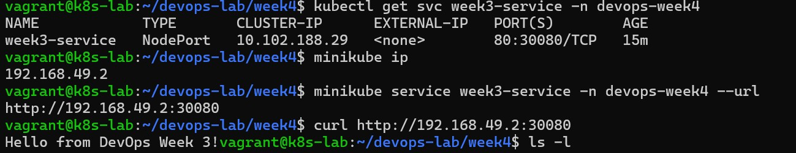

# For this lab, since I am using laptop, I will work with minikube, to setup everything on one VM

1. Initial OS setup

```bash
sudo apt update && sudo apt upgrade -y
sudo apt install -y \
  ca-certificates \
  curl \
  gnupg \
  lsb-release \
  apt-transport-https \
  software-properties-common \
  git \
  unzip
```

2. Install Docker (required by Minikube)

```bash
curl -fsSL https://get.docker.com | sudo sh
sudo usermod -aG docker $USER
newgrp docker
```

3. Install Kubectl

```bash
curl -LO "https://dl.k8s.io/release/$(curl -Ls https://dl.k8s.io/release/stable.txt)/bin/linux/amd64/kubectl"
chmod +x kubectl
sudo mv kubectl /usr/local/bin/
```

4. Install Minikube

```bash
curl -LO https://storage.googleapis.com/minikube/releases/latest/minikube-linux-amd64
chmod +x minikube-linux-amd64
sudo mv minikube-linux-amd64 /usr/local/bin/minikube
```

5. Install Helm

```bash
curl https://raw.githubusercontent.com/helm/helm/main/scripts/get-helm-3 | bash
```

6. Enable Ingress

```bash
minikube addons enable ingress
```

7. Install ArgoCD

```bash
kubectl create namespace argocd

kubectl apply -n argocd \
  -f https://raw.githubusercontent.com/argoproj/argo-cd/stable/manifests/install.yaml

kubectl get pods -n argocd

kubectl port-forward svc/argocd-server -n argocd 8080:443

kubectl get secret argocd-initial-admin-secret \
  -n argocd \
  -o jsonpath="{.data.password}" | base64 -d
```

8. Install Jenkins

```bash
docker run -d \
  --name jenkins \
  -p 8081:8080 \
  -p 50000:50000 \
  -v jenkins_home:/var/jenkins_home \
  jenkins/jenkins:lts
```


# Common Kubernetes Commands

```bash
kubectl get nodes
kubectl get pods -A
kubectl describe node <node>
kubectl create namespace devops-week4
kubectl config view
```

# Deploy busybox pod and interact with it

```bash
kubectl run test --image=busybox --namespace=devops-week4 -- sleep 3600

kubectl exec -it busybox -n devops-week4 -- sh

hostname
ip a
ls /
exit

```

==== Deploy app on Kubernetess Cluster =====

Create directory week4/k8-manifests and create below files in this directory
Deployment.yaml

```bash
apiVersion: apps/v1
kind: Deployment
metadata:
  name: week3-app
  namespace: devops-week4
spec:
  replicas: 2
  selector:
    matchLabels:
      app: week3-app
  template:
    metadata:
      labels:
        app: week3-app
    spec:
      containers:
      - name: web
        image: sanaqvi573/week3-app:latest
        ports:
        - containerPort: 5000
```

Service.yaml

```bash
apiVersion: v1
kind: Service
metadata:
  name: week3-service
  namespace: devops-week4
spec:
  type: NodePort
  selector:
    app: week3-app
  ports:
    - port: 80
      targetPort: 5000
      nodePort: 30080
```

# Now deploy manifest and debug

```bash
kubectl apply -f k8s-manifests/

kubectl logs -l app=week3-app -n devops-week4
kubectl describe pod <pod>
```


